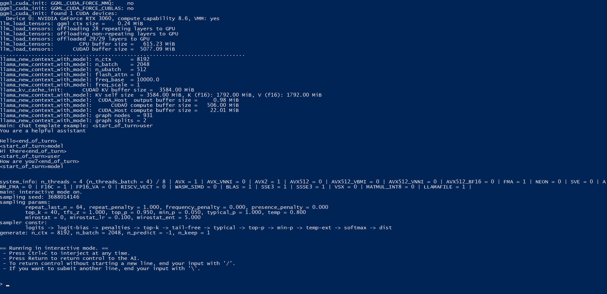

## Практическое задание 1. Создание рекомендаций по документации на основе ЕСПД и SWEBOK с использованием языковой модели.

1. Склонировал репозиторий [llama.cpp](https://github.com/ggerganov/llama.cpp)
2. Сбилдил llama.cpp. Для этого выполнил следующие команды:
   
    cmake -B build -DGGML_CUDA=ON

    cmake --build build --config Release

3. Перешел по пути \build\bin\Release и запустил llama-cli.exe с помощью команды:

    ./llama-cli.exe -m "gemma-1.1-7b-it.Q4_K_M.gguf" -cnv -ngl 99 --color

Ура, теперь можно общаться

Все вопросы задавал по шаблону:

> Предоставь мне полную инструкцию по использованию ______ в формате markdown. "Текст документа".

Ответы:

### [ГОСТ-19.201-78](gost19.201-78.md)
### [ГОСТ-19.202-78](gost19.202-78.md)
### [ГОСТ-19.301-79](gost19.301-79.md)
### [ГОСТ-19.102-77](gost19.102-77.md)
### [SWEBOK](swebok.md)